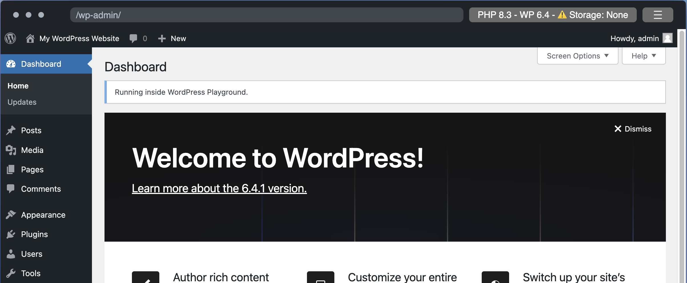

# Playground Plugin Admin Notice

Basic example demonstrating how to display an admin notice inside the WordPress Playground.

This repository includes the [plugin source code](playground-plugin-admin-notice), the [plugin ZIP file](playground-plugin-admin-notice.zip), the default [blueprint.json](blueprint.json), and the [blueprint-override-message.json](blueprint-override-message.json) for overriding the default message.



## How to use

This repository is designed for using the `raw` GitHub URLs to load both the plugin and the blueprint into the playground.

### WordPress Playground URLs

- Loading the blueprint as URL fragment: [`https://playground.wordpress.net/#{"landingPage":"/wp-admin/","steps":[{"step":"installPlugin","pluginZipFile":{"resource":"url","url":"https://raw.githubusercontent.com/sejas/playground-plugin-admin-notice/main/playground-plugin-admin-notice.zip"}},{"step":"login","username":"admin","password":"password"}]}`](https://playground.wordpress.net/#{"landingPage":"/wp-admin/","steps":[{"step":"installPlugin","pluginZipFile":{"resource":"url","url":"https://raw.githubusercontent.com/sejas/playground-plugin-admin-notice/main/playground-plugin-admin-notice.zip"}},{"step":"login","username":"admin","password":"password"}]})
- Loading the blueprint usint the URL: [`https://https://playground.wordpress.net/?blueprint-url=https://raw.githubusercontent.com/sejas/playground-plugin-admin-notice/main/playground-plugin-admin-notice.zip`](https://https://playground.wordpress.net/?blueprint-url=https://raw.githubusercontent.com/sejas/playground-plugin-admin-notice/main/playground-plugin-admin-notice.zip)

### Override WordPress notice message using options

- Display a custom message: [`https://playground.wordpress.net/#{"landingPage":"/wp-admin/","steps":[{"step":"setSiteOptions","options":{"playground_admin_notice":"This is a custom message."}},{"step":"installPlugin","pluginZipFile":{"resource":"url","url":"https://raw.githubusercontent.com/sejas/playground-plugin-admin-notice/main/playground-plugin-admin-notice.zip"}},{"step":"login","username":"admin","password":"password"}]}`](https://playground.wordpress.net/#{"landingPage":"/wp-admin/","steps":[{"step":"setSiteOptions","options":{"playground_admin_notice":"This%20is%20a%20custom%20message."}},{"step":"installPlugin","pluginZipFile":{"resource":"url","url":"https://raw.githubusercontent.com/sejas/playground-plugin-admin-notice/main/playground-plugin-admin-notice.zip"}},{"step":"login","username":"admin","password":"password"}]})

**Blueprint for displaying a custom message**

```json
{
  "landingPage": "/wp-admin/",
  "steps": [
    {
      "step": "setSiteOptions",
      "options": {
        "playground_admin_notice": "This is a custom message."
      }
    },
    {
      "step": "installPlugin",
      "pluginZipFile": {
        "resource": "url",
        "url": "https://raw.githubusercontent.com/sejas/playground-plugin-admin-notice/main/playground-plugin-admin-notice.zip"
      }
    },
    {
      "step": "login",
      "username": "admin",
      "password": "password"
    }
  ]
}
```

### How to contribute

Please feel welcome to open an issue or submit a pull request if you have any suggestions for improvements or modifications.
